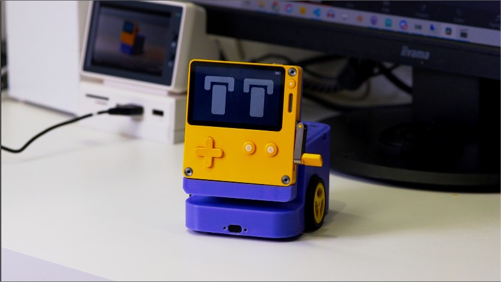

# 🤖 PlayBot

PlayBot is an unofficial, experimental accessory for Panic Inc.'s Playdate handheld console, which transforms your console into a lovely little desktop robot. 
With its integrated charging capabilities, it can serve as a charging dock for your Playdate.

Here is a little video of Playbot (click to watch)

⚡ Battery life: ~45 min of autonomous operation per charge.

 
 

## ⚠️ Disclaimer

This project is not affiliated with nor endorsed by [Panic](https://panic.com/).

I cannot be held responsible for any damage, data loss, short circuit, burned down house, etc. 😘

## 🔧 Hardware

The project is based on a Teensy 4.1 microcontroller that acts as a USB hub for the Playdate and communicates over serial. 

The Playdate acts as the robot's brain and sends commands to the Teensy to control motors and gather various sensor values:

- 2 TOF distance sensors
- TEMT6000 Ambient light sensor
- 2 IR sensors
- Dual motors with encoders
- MAX1704X fuel gauge 

I'm also using the Playdate's integrated sensors:
- Accelerometer
- Microphone

Additionnal Vision AI camera powered by [Huskylens](https://www.dfrobot.com/product-1922.html) will be compatible.

PlayBot's frame is fully 3D printed. A complete bill of materials and assembly instructions can be found [here](https://github.com/GuybrushTreep/PlayBot/tree/main/hardware) 

## 💾 Firmware

You can flash the [firmware](https://github.com/GuybrushTreep/PlayBot/tree/main/src/PlayBot) using the Arduino IDE and Teensyduino add-on available [here](https://www.pjrc.com/teensy/teensyduino.html).

## 📚 Dependencies 
  - [USBHost_t36](https://github.com/PaulStoffregen/USBHost_t36) by [PaulStoffregen](https://github.com/PaulStoffregen)
  - [Encoder](https://github.com/PaulStoffregen/Encoder) by [PaulStoffregen](https://github.com/PaulStoffregen) 
  - [drv8835-motor-shield](https://github.com/pololu/drv8835-motor-shield) by [pololu](https://github.com/pololu)
  - [SD library](https://github.com/arduino-libraries/SD) by [Arduino](https://github.com/arduino-libraries)
  - [Servo library](https://github.com/arduino-libraries/Servo) by [Arduino](https://github.com/)
  - [MAX1704X](https://github.com/adafruit/Adafruit_MAX1704X) by [adafruit](https://github.com/adafruit)
  - [PID_V1](https://github.com/br3ttb/Arduino-PID-Library) by [br3ttb](https://github.com/br3ttb)
  - [WS2812FX](https://github.com/kitesurfer1404/WS2812FX) by [kitesurfer1404](https://github.com/kitesurfer1404/WS2812FX)
  - [CircularBuffer](https://github.com/rlogiacco/CircularBuffer) by [rlogiacco](https://github.com/kitesurfer1404/WS2812FX)

## 📱 Companion App

The app, written in Lua, needs to be sideloaded onto the Playdate and is located in a [separate repository](https://github.com/GuybrushTreep/pd-playbot-app).

## 🎨 Custom rig

A Custom rig and sequence exporter written in python is also available for Blender in a [seperate repository](https://github.com/GuybrushTreep/Playbot_Rig).
Animate, render and export custom animation sequences!

## ⚠️ Known Issues
* ToF sensors show unreliable readings when pointing into empty space (possibly defective units) - planning to replace with IR sensors
* Battery gauge readings become erratic under high current load - investigation ongoing

## 📜 License

[MIT](https://choosealicense.com/licenses/mit/)