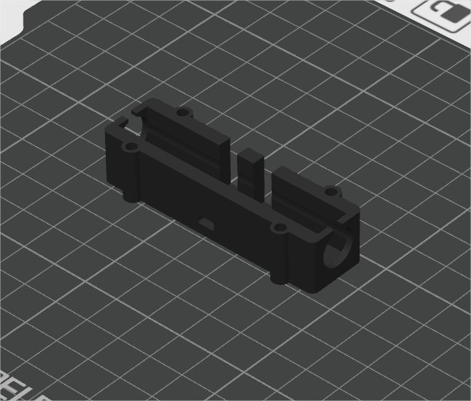
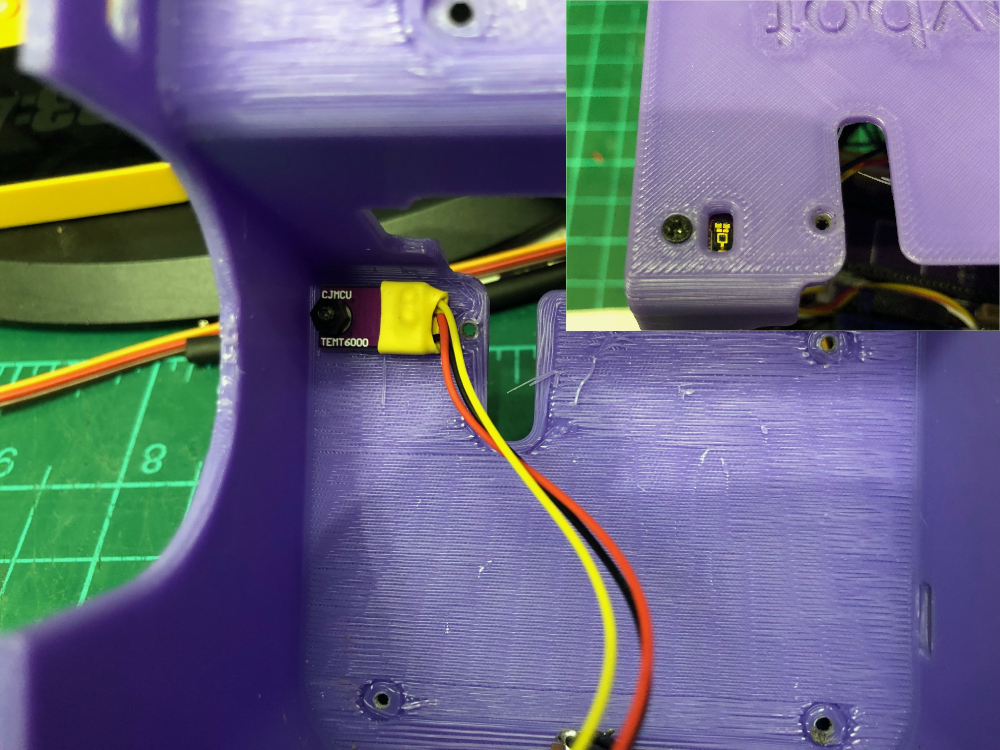

## Summary
- [Bill of materials](#bill-of-materials)
- [Recommended tools](#Recommended-tools)
- [3d printed parts](#3d-printed-parts)
- [Custom PCBs](#custom-pcbs)
    - [Power board](#power-board)
    - [Main board](#main-board)
- [Assembly](#assembly)
    - [Top Frame](#Top-Frame)
        - [Servo mod](#servo-modification)
        - [Brass insert](#brass-inserts)
    - [Middle Frame](#middle-frame)
        - [DRV8835](#drv8835)
        - [Power harness](#power-harness)
    - [Lower Frame](#lower-frame)
        - [Ball caster wheels](#ball-caster-wheels)
        - [ITR20001-sensors](#itr20001-sensors)
    - [console base](#console-base)
        - [Usb](#usb)  
    - [Shell](#Shell)
        - [light sensor](#TEMT6000-light-sensor)
        - [switch](#SPDT-switch)
        - [TOF10120](#TOF-sensors)
     - [Putting Everything Together](#Putting-Everything-Together)
# Bill of materials

This folder contains all the files and instructions to build Playbot.

## Hardware

|Item| Quantity|Notes
|---|---|---|
|Custom PCBs|2|Order from [JLCPCB](https://jlcpcb.com) see Gerber files and BOMs
|Teensy 4.1 microcontroller| 1|[PJCRC store](https://www.pjrc.com/store/teensy41.html)
| TOF10120| 2| [AlliExpress](https://fr.aliexpress.com/item/1005006355757514.html?spm=a2g0o.detail.pcDetailTopMoreOtherSeller.3.5152nL9knL9kkQ&gps-id=pcDetailTopMoreOtherSeller&scm=1007.40050.354490.0&scm_id=1007.40050.354490.0&scm-url=1007.40050.354490.0&pvid=43a39a83-8bf7-4a9d-b2aa-4d4200da0014&_t=gps-id:pcDetailTopMoreOtherSeller,scm-url:1007.40050.354490.0,pvid:43a39a83-8bf7-4a9d-b2aa-4d4200da0014,tpp_buckets:668%232846%238107%231934&isseo=y&pdp_npi=4%40dis%21EUR%214.29%214.29%21%21%214.68%214.68%21%402103895417271255595797778e7ce3%2112000037973716121%21rec%21FR%21%21ABXZ&utparam-url=scene%3ApcDetailTopMoreOtherSeller%7Cquery_from%3A)
| Low profile headers 12 pins| 1| [Example  AlliExpress](https://fr.aliexpress.com/item/1005006252502654.html?spm=a2g0o.productlist.main.23.f22a276csirRub&algo_pvid=8485fcfc-69b6-4fa3-bf40-6245eae15df8&algo_exp_id=8485fcfc-69b6-4fa3-bf40-6245eae15df8-11&pdp_npi=4%40dis%21EUR%215.08%210.99%21%21%2139.04%217.62%21%40211b618e17271256823062451e979f%2112000036477546171%21sea%21FR%210%21ABX&curPageLogUid=J2GVUPW2oOxk&utparam-url=scene%3Asearch%7Cquery_from%3A)
| SG90 servo | 1 | [Example AlliExpress](https://fr.aliexpress.com/item/1005006522732429.html?spm=a2g0o.productlist.main.1.2e7078dbdj347Y&algo_pvid=9f489bd2-ea5e-4c4a-88c8-4c1252d9fda9&algo_exp_id=9f489bd2-ea5e-4c4a-88c8-4c1252d9fda9-0&pdp_npi=4%40dis%21EUR%210.72%210.72%21%21%215.53%215.52%21%4021038dfc17271932356175976eb3da%2112000037520326755%21sea%21FR%210%21ABX&curPageLogUid=ZAvrS4F64GvW&utparam-url=scene%3Asearch%7Cquery_from%3A)
| ITR20001 | 2| [Example AlliExpress](https://fr.aliexpress.com/item/1005007697148589.html?spm=a2g0o.productlist.main.25.715e137foby4aC&algo_pvid=6a9c50a2-0cd5-4385-87a5-524ec2daa876&algo_exp_id=6a9c50a2-0cd5-4385-87a5-524ec2daa876-12&pdp_npi=4%40dis%21EUR%211.69%211.69%21%21%2112.98%2112.98%21%40211b618e17271258031226100e979f%2112000041890684018%21sea%21FR%210%21ABX&curPageLogUid=HXnZdCWkpzS6&utparam-url=scene%3Asearch%7Cquery_from%3A)
TEMT6000 ambient light sensor | 1 | [Example AlliExpress](https://fr.aliexpress.com/item/33034437035.html?src=google&pdp_npi=4%40dis%21EUR%211.18%211.18%21%21%21%21%210.9238%40%2167317181845%21ppc%21%21%21&src=google&albch=shopping&acnt=248-630-5778&isdl=y&slnk=&plac=&mtctp=&albbt=Google_7_shopping&aff_platform=google&aff_short_key=UneMJZVf&gclsrc=aw.ds&&albagn=888888&&ds_e_adid=&ds_e_matchtype=&ds_e_device=c&ds_e_network=x&ds_e_product_group_id=&ds_e_product_id=fr33034437035&ds_e_product_merchant_id=109029711&ds_e_product_country=FR&ds_e_product_language=fr&ds_e_product_channel=online&ds_e_product_store_id=&ds_url_v=2&albcp=19000710609&albag=&isSmbAutoCall=false&needSmbHouyi=false&gad_source=1&gclid=Cj0KCQjwxsm3BhDrARIsAMtVz6MFOhQxDsbiriZIzvAo15Y8bk2Jd7PBYBp9_BYVgLwGeoBBeu02b44aAlGTEALw_wcB)
| mini ball caster wheels| 2| [Example AlliExpress](https://fr.aliexpress.com/item/1005007392098564.html?spm=a2g0o.detail.pcDetailTopMoreOtherSeller.5.6e78Rqs4Rqs4fD&gps-id=pcDetailTopMoreOtherSeller&scm=1007.40050.354490.0&scm_id=1007.40050.354490.0&scm-url=1007.40050.354490.0&pvid=af027fb5-cab6-4c62-8038-6874711e65c5&_t=gps-id:pcDetailTopMoreOtherSeller,scm-url:1007.40050.354490.0,pvid:af027fb5-cab6-4c62-8038-6874711e65c5,tpp_buckets:668%232846%238112%231997&isseo=y&pdp_npi=4%40dis%21EUR%210.21%210.21%21%21%210.23%210.23%21%402103895417271259822313224e7ce3%2112000040559594027%21rec%21FR%21%21ABXZ&utparam-url=scene%3ApcDetailTopMoreOtherSeller%7Cquery_from%3A)
| N20 6V 500RPM motors| 2| [Example AlliExpress](https://fr.aliexpress.com/item/1005004999529855.html?spm=a2g0o.productlist.main.9.476c1b8bwLt7Fn&algo_pvid=a0f07c90-ab69-40fd-ac62-188fc3763f3e&algo_exp_id=a0f07c90-ab69-40fd-ac62-188fc3763f3e-4&pdp_npi=4%40dis%21EUR%215.62%215.59%21%21%216.13%216.09%21%40211b618e17271261375738397e979f%2112000031302274043%21sea%21FR%210%21ABX&curPageLogUid=eIQ0fq7ROtye&utparam-url=scene%3Asearch%7Cquery_from%3A)
| N20 wheels| 2| [Example AlliExpress](https://fr.aliexpress.com/item/1005006640418754.html?spm=a2g0o.productlist.main.5.4390186ciMbiiV&algo_pvid=18114de1-0e8b-411d-8a66-9a63acacee0f&algo_exp_id=18114de1-0e8b-411d-8a66-9a63acacee0f-2&pdp_npi=4%40dis%21EUR%213.48%213.48%21%21%2126.71%2126.71%21%40211b618e17271262014572380e979f%2112000037899571195%21sea%21FR%210%21ABX&curPageLogUid=5F51BSrBxRqD&utparam-url=scene%3Asearch%7Cquery_from%3A)
| DRV8835 Dual Motor Driver Carrier| 1| [Pololu](https://www.pololu.com/product/2135)
| M2 Screws| 1 box| [Example AlliExpress](https://fr.aliexpress.com/item/1005002426046826.html?spm=a2g0o.productlist.main.17.5d2c02qB02qBON&algo_pvid=4e237d3e-e61e-4861-bcfc-cd9006211bb3&algo_exp_id=4e237d3e-e61e-4861-bcfc-cd9006211bb3-8&pdp_npi=4%40dis%21EUR%212.73%210.99%21%21%212.96%211.08%21%4021039f3217271904604808941e395c%2112000020776755059%21sea%21FR%210%21ABX&curPageLogUid=j6ltcxIlb15M&utparam-url=scene%3Asearch%7Cquery_from%3A)
| M2 and M3 nylon nut set| | [Example Alliexpress](https://fr.aliexpress.com/item/33017191364.html?spm=a2g0o.productlist.main.61.58a8UaSaUaSax1&algo_pvid=998d6187-33be-4231-9b5a-b7b2b76323f7&algo_exp_id=998d6187-33be-4231-9b5a-b7b2b76323f7-30&pdp_npi=4%40dis%21EUR%210.83%210.83%21%21%210.91%210.91%21%40211b81a317277321413732983efdee%2167143762064%21sea%21FR%210%21ABX&curPageLogUid=iqw6aZ0Hb3BB&utparam-url=scene%3Asearch%7Cquery_from%3A)
| M2 X 5 insert| 1 box| [Example AlliExpress](https://fr.aliexpress.com/item/1005007481465353.html?spm=a2g0o.productlist.main.7.93fd220ekV5QSL&algo_pvid=bfa72422-5d3a-44a2-8795-4eb09a8bf643&algo_exp_id=bfa72422-5d3a-44a2-8795-4eb09a8bf643-33&pdp_npi=4%40dis%21EUR%217.39%217.39%21%21%2156.58%2156.58%21%402103879317271908727925510eee95%2112000040927838417%21sea%21FR%210%21ABX&curPageLogUid=NgA9mCPcnJIl&utparam-url=scene%3Asearch%7Cquery_from%3A)
| USBC connectors Male/Female| 1 | [Example AlliExpress](https://fr.aliexpress.com/item/1005004807492800.html?spm=a2g0o.productlist.main.3.6a1c713dWuoKkp&algo_pvid=f8315998-da24-4298-9379-5cac4823c946&algo_exp_id=f8315998-da24-4298-9379-5cac4823c946-1&pdp_npi=4%40dis%21EUR%211.49%210.99%21%21%211.62%211.08%21%40210384cc17271912443301441e5c75%2112000030569163725%21sea%21FR%210%21ABX&curPageLogUid=2nOJae7BAOXq&utparam-url=scene%3Asearch%7Cquery_from%3A)
| SPDT switch| 1 | [Example AlliExpress](https://fr.aliexpress.com/item/32812689209.html?spm=a2g0o.productlist.main.11.540d62c3AtlIoR&algo_pvid=5dab6dae-69ef-4f38-b764-05826455a47c&algo_exp_id=5dab6dae-69ef-4f38-b764-05826455a47c-5&pdp_npi=4%40dis%21EUR%211.12%210.99%21%21%211.22%211.08%21%40211b6d3517271916289168180ed8d9%2164701560453%21sea%21FR%210%21ABX&curPageLogUid=cmJiNlaNp427&utparam-url=scene%3Asearch%7Cquery_from%3A)
| Battery Lipo 1S 15000mAh 504050 | 1 | [Example AlliExpress](https://fr.aliexpress.com/item/32988366494.html?spm=a2g0o.productlist.main.5.77943e84pQCqFZ&algo_pvid=cedb2f8b-3d26-42ff-8e4b-c06506aa87fa&algo_exp_id=cedb2f8b-3d26-42ff-8e4b-c06506aa87fa-2&pdp_npi=4%40dis%21EUR%216.03%215.99%21%21%216.54%216.50%21%402103856417271918529103475ee9e2%2166794003013%21sea%21FR%210%21ABX&curPageLogUid=IWsQVFLzjuwk&utparam-url=scene%3Asearch%7Cquery_from%3A)
| Pre crimped JST SH connector set 3 to 7 pins (pre crimped is much easier)| 1 | [Example AlliExpress](https://fr.aliexpress.com/item/1005004705798387.html?spm=a2g0o.productlist.main.17.6af84dbbMv6Q9z&algo_pvid=2816c474-a09c-4c15-ade2-a59e3dea51de&algo_exp_id=2816c474-a09c-4c15-ade2-a59e3dea51de-8&pdp_npi=4%40dis%21EUR%211.57%210.99%21%21%211.70%211.07%21%40211b65de17271921112724246ede95%2112000030170307469%21sea%21FR%210%21ABX&curPageLogUid=Dim0x4dEra8M&utparam-url=scene%3Asearch%7Cquery_from%3A)
| JST PH connector Male/Female 2/4 pins | 1 box | [Example AlliExpress](https://fr.aliexpress.com/item/1005006498660940.html?spm=a2g0o.productlist.main.1.5be7e53b3rHXwg&algo_pvid=47ccf818-19de-41fa-b940-ce6a1f06d550&algo_exp_id=47ccf818-19de-41fa-b940-ce6a1f06d550-0&pdp_npi=4%40dis%21EUR%213.01%210.99%21%21%213.26%211.07%21%402103868d17271927901213422e1641%2112000037425305641%21sea%21FR%210%21ABX&curPageLogUid=USXJf5pJkqR8&utparam-url=scene%3Asearch%7Cquery_from%3A)
| Flanged ball bearing 6X3X2.5 | 2 | [Example AlliExpress](https://fr.aliexpress.com/item/32969015516.html?spm=a2g0o.productlist.main.3.586d6bf817bbwF&algo_pvid=04ae072f-a77a-4c8c-a72f-fee04431f674&algo_exp_id=04ae072f-a77a-4c8c-a72f-fee04431f674-1&pdp_npi=4%40dis%21EUR%213.59%213.59%21%21%213.89%213.89%21%40211b80e117272049218613102e1fe2%2166588829720%21sea%21FR%210%21ABX&curPageLogUid=1cYg3OXHQMLk&utparam-url=scene%3Asearch%7Cquery_from%3A)
| Nylon M3 X 40 screw  | 1 | [Example AlliExpress](https://fr.aliexpress.com/item/1005003130662735.html?spm=a2g0o.productlist.main.9.38cd78b0LKOFkI&algo_pvid=4a069db4-0918-4b13-b2b5-e0f25a9854a5&algo_exp_id=4a069db4-0918-4b13-b2b5-e0f25a9854a5-4&pdp_npi=4%40dis%21EUR%211.44%211.37%21%21%211.57%211.49%21%4021039e0c17277341100491598e5524%2112000024260289627%21sea%21FR%210%21ABX&curPageLogUid=qN1JAKJijF9j&utparam-url=scene%3Asearch%7Cquery_from%3A)
| Magnets 6X3| 4 | [Example AlliExpress](https://fr.aliexpress.com/item/1005006291065081.html?spm=a2g0o.productlist.main.5.1542Qf4qQf4q3P&algo_pvid=55609d9a-a952-4d67-82f9-ec55e0bcc53d&algo_exp_id=55609d9a-a952-4d67-82f9-ec55e0bcc53d-2&pdp_npi=4%40dis%21EUR%212.45%210.99%21%21%2118.76%217.62%21%40211b813c17272078815273190e3b6f%2112000036632421438%21sea%21FR%210%21ABX&curPageLogUid=kq2mNsJMVCzA&utparam-url=scene%3Asearch%7Cquery_from%3A)
| Servo pull rod 120 mm| 1 | [Example AlliExpress](https://www.aliexpress.us/item/3256807116664206.html?spm=a2g0o.productlist.main.11.2340Jvx0Jvx0qE&algo_pvid=db665c48-aec3-4a6c-834a-dba8be968ce4&algo_exp_id=db665c48-aec3-4a6c-834a-dba8be968ce4-5&pdp_npi=4%40dis%21EUR%212.49%210.99%21%21%2118.71%217.45%21%402103868a17313546987914769e2bd1%2112000040199743168%21sea%21FR%210%21ABX&curPageLogUid=eaJh4OKVUcVg&utparam-url=scene%3Asearch%7Cquery_from%3A&gatewayAdapt=glo2usa4itemAdapt)
| 1.3mm push rod connector| 1 |[Example AlliExpress](https://www.aliexpress.us/item/2255800230609318.html?spm=a2g0o.productlist.main.29.4b55QeqQQeqQDV&algo_pvid=700d217b-4f44-4084-85a9-6c46fda9fe91&algo_exp_id=700d217b-4f44-4084-85a9-6c46fda9fe91-14&pdp_npi=4%40dis%21USD%214.99%213.99%21%21%214.99%213.99%21%40211b819117313549045874610e3d14%2110000001783126286%21sea%21US%210%21ABX&curPageLogUid=cRb5HZZq58mU&utparam-url=scene%3Asearch%7Cquery_from%3A)
| Micro SD card| 1 |
| 24 AWG wire in various colors| 1 |
| HuskyLens (optional, for advanced AI vision) | 1 | [DFRobot](https://www.dfrobot.com/product-1922.html?gad_source=1&gclid=Cj0KCQjwxsm3BhDrARIsAMtVz6O7-u6SEQ5DpgK14Sa_zBdhd3W4jWqcs46tiPwW6idb2EYJas_s3SIaAipaEALw_wcB)
|A playdate !| 1 | [Play.date](https://play.date/)

**Price range**: Around 100/120 $ (without shipping) **per bot**. Custom PCBs are cheap (10$ a piece) but you have to order in bulk of 5. 

⚠️⚠️ Playbot is not a plug-and-play project as it requires a lot of soldering and custom connectors/wires. ⚠️⚠️

**This is a first prototype, and I'm already working on a V2 with only one PCB and less soldering involved.**

## Recommended tools

| Tool | Notes |
|------|-------|
| Soldering Iron |  |
| Flux | For clean solder joints |
| Heat Shrink Tubing | 1/2 mm|
| Precision Screwdrivers |  |
| JST PH Crimp Tool | For JST PH connectors |
| JST SH Crimp Tool | Optional - expensive, can use pre-crimped wires instead |
| Kapton Tape |  |
|  Wire strippers  | (20-30 AWG) |
|  Tweezers  ||
|  Helping hands with magnifying glass|  |

## 3D Printed Parts

STL files are available [here](../hardware/3dPrinted_Parts)

I print these on a Bambu Lab A1 mini with generic PLA. 

## Custom PCBs
### Power Board

1-cell LiPo charger (MCP73831) with 5V boost converter (TPS61023) and fuel gauge (MAX17048). The board is capable of load-sharing and can be plugged in while running the robot. 
This board will also charge the Playdate when the robot is active. 
Red LED when charging/Yellow LED when fully charged.

### Main Board 

A board that connects various sensors/motors/servos and distributes power to the Teensy.
You will need special low-profile headers to fit the Teensy inside the case.
 
 ⚠️⚠️ **Important: To protect your battery-powered Teensy, it is recommended to cut the USB power trace.** ⚠️⚠️

 

- Solder male headers on Teensy main side pins and USB host pins.

 

- Solder female low-profile headers on the Playbot main board. 

 

## Assembly

### Testing

⚠️⚠️ For every step, I strongly advise you to double-check your connections, flash the test [firmware](https://github.com/GuybrushTreep/PlayBot/tree/main/src/Playbot_SensorsTest) to the Teensy, plug in your components, and test the boot sequence to ensure everything is working correctly. ⚠️⚠️ 

### Top Frame

#### Servo Modification:

- Cut the left plastic ear flush.
- Open the servo case by removing the 4 screws.
- Cut/desolder the wires. Take note of the color code: **brown** -> **GND** | **red** -> **V+** | **orange** -> **signal**.
- Solder new wires with a JST SH connector. Pay attention to the **servo** connector wiring. 

Also, due to tight space constraints, the servo horn needs to be modified.

The hole is enlarged with a soldering iron and press-fitted onto the servo axle while soft, center the servo position with the test firmware before screwing it.

#### Brass Inserts

Check this excellent [tutorial](https://www.youtube.com/watch?v=KC1LLU54DKU&ab_channel=GeekDetour) for heated brass inserts on PLA.

- Add 5 brass inserts on the top of the frame:

- And 4 others on the frame's bottom: 

- Screw the mainboard directly into the frame using M2 * 4 screws.
- Press-fit the 2 ball bearings into the frame

- Solder the power switch and USB-C input to the power management board. Press-fit the USB-C plug into the bottom frame. You can add a bit of hot glue to secure it to the frame.

- You can now screw the power board to the frame's bottom. 

- The lipo baterry slides into a dedicated socket on the frame.

### Middle Frame

- Add 4 brass inserts.

#### DRV8835
The DRV8835 board is attached directly in the middle of the part with double-sided adhesive.

- Solder pins MODE, AIN1, AIN2, BIN1, BIN2, VCC, and GND to a 7-pin JST SH connector for the motors Connector.

Please check the [Pololu](https://www.pololu.com/product/2135) page for more information about this board.

- Create a custom plug for motors. Power comes from the DRV8835 board (M1 and M2), and the 4 other wires are for encoder feedback (ENC1, ENC2).

- Before adding motors, you must attach the middle and top frame together with 2 M2 screws. 

#### Power Harness

Create a power harness with JST **PH** connectors to power the main board and DRV8835 from the power board's power output. 

** note: I replaced the Main board's PH connector with simple solder pads on the last revision** 

## Lower Frame

### Ball Caster Wheels

- Remove screws, insert the ball caster wheels, and screw them back to the frame.

## Console Base 

### USB 

- Create a USB plug connected to a 4-pin JST **PH** connector. 
You can add a bit of hot glue to secure the PH connector.

- Create a 4-pin **PH** to **SH** connector that will connect to **USERIAL** connector on the main board.

The USB plugs comes with little plastic rings that you can glue to the part.

- Press-fit magnets into the dock.

## Shell

### TEMT6000 Light Sensor

- Solder a 3-pin JST **SH** connector that connects to **TEMT** connector on the main board.

- Screw and bolt it to the shell.

### SPDT Switch

- Screw and bolt the switch to the shell.

### TOF Sensors

- Solder a 4-pin JST **SH** connector that connects to **TOF1** and **TOF2** on the main board. You can cut RX/TX wires as we use I²C through a 2-channel multiplexer.

- Attach both sensors at the front and back of the shell with M2.5x6 screws and nylon nuts. 

## Putting Everything Together

At this point, you're almost done. Congratulations! I assume you've already tested every component by flashing the test firmware. 

⚠️⚠️ Don't forget to flash the micro SD card with the [animation files](https://github.com/GuybrushTreep/Playbot_Rig/tree/main/Animations/Export). You can still access the SD card from your computer with the help of this library: https://github.com/KurtE/MTP_Teensy ⚠️⚠️

If no errors show up, you're good to assemble the remaining parts in this order:

This is the tricky part, as everything will be tightly packed inside the shell.

Attach the screen base with M3 screw, do not overtighten it. 
Cut a Servo pull rod at 20 mm and attach it to the servo's arm with a connector.

Congratulations, your Playbot is now complete!

